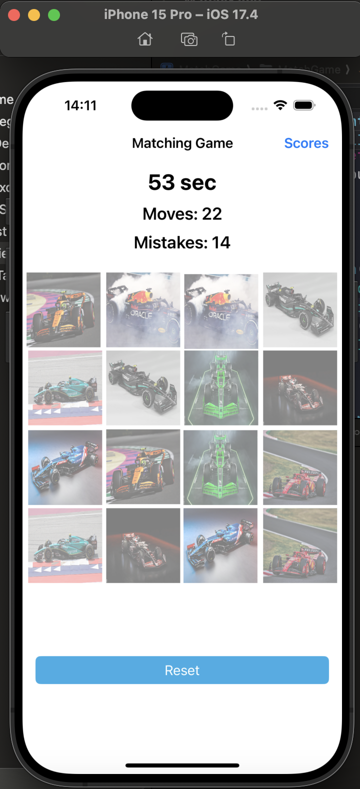
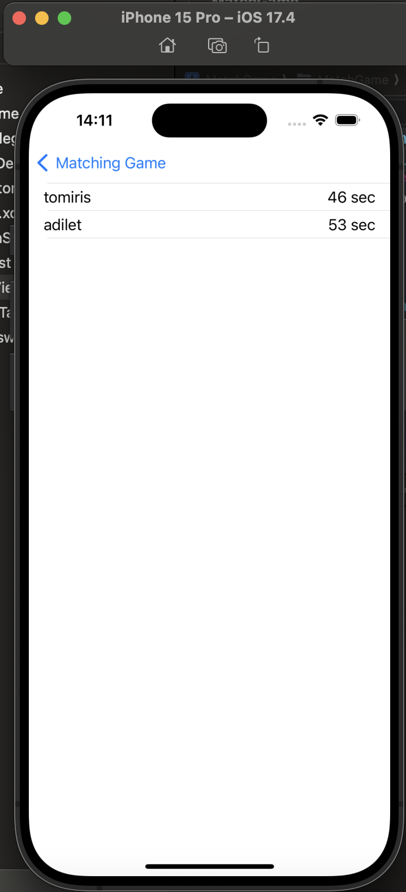

# 4x4 Matching Game

A 4x4 Matching Game (also known as a Memory Game or Concentration Game) implemented using UIKit for iOS. The goal of the game is to match pairs of cards, and the game board consists of a 4x4 grid of cards. The game includes features such as a timer, score tracking, and mistake counting, saving user scores and listing them in a separate table view.

## Table of Contents

- [Features](#features)
- [Usage](#usage)
- [Screenshots](#screenshots)

## Features

- A 4x4 grid of cards to match pairs.
- Timer to track how long it takes to complete the game.
- Count of moves made and mistakes.
- Restart and reset functionality.
- Shuffle and generate random card distribution at the start of the game.
- Save your score using alert view controller.
- List all saved scores.

## Usage

1. Press the "Play" button to start a new game.
2. Match pairs of cards by tapping on them.
3. The game ends when all pairs are matched.
4. If you would like to save your score, alert window will offer that option. Or just cancel play more.
5. Use the "Restart" option in the end game alert to play again.
6. Go to "Scores" table view to see all saved scoresю.

## Screenshots

